# Chapter 11 立体几何与空间向量

## 11.1 立体直角坐标系
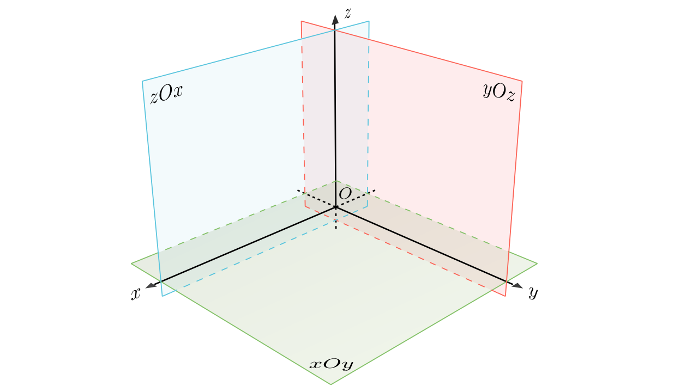
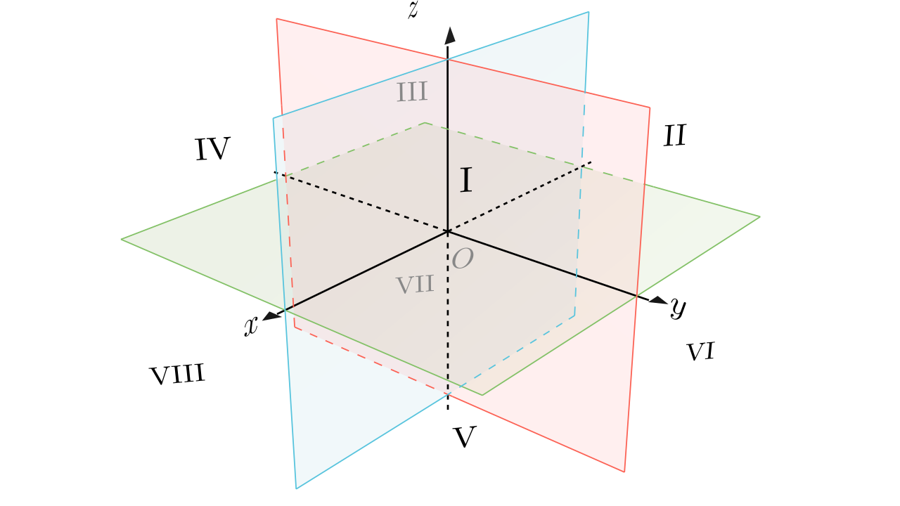

 

## 11.2 向量

1. Concepts
* 从低维到高维

* 几何意义
  * 向量 $\lArr$ 空间中的点
  * 
* 向量的分量

    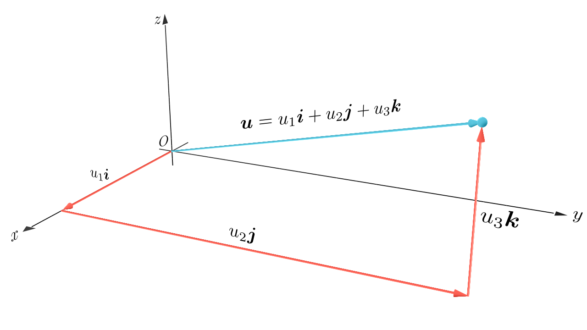

2. 向量加法
3. 向量数乘
4. 向量减法
5. 线性性质：
    加法：交换律、结合律
    数乘：交换律、结合律、分配律
6. 向量长度
 

## 11.3 点积（数量积）

a. 定义 $\quad \sum u_iv_i$: 标量
b. 几何意义:一个 **向量的长度** 乘以另一个向量 **投影的长度**

 

1. 向量夹角

> $若\boldsymbol{u}、\boldsymbol{v}$都不是零向量，其夹角为$(\widehat{\boldsymbol{u},\boldsymbol{v}})=\theta$，则$\cos\theta=\displaystyle\frac{\boldsymbol{u}\cdot\boldsymbol{v}}{\|\boldsymbol{u}\|\|\boldsymbol{v}\|}。$

*例:向量与坐标轴的夹角*

 

2. 方向角与方向余弦
   

    投影
    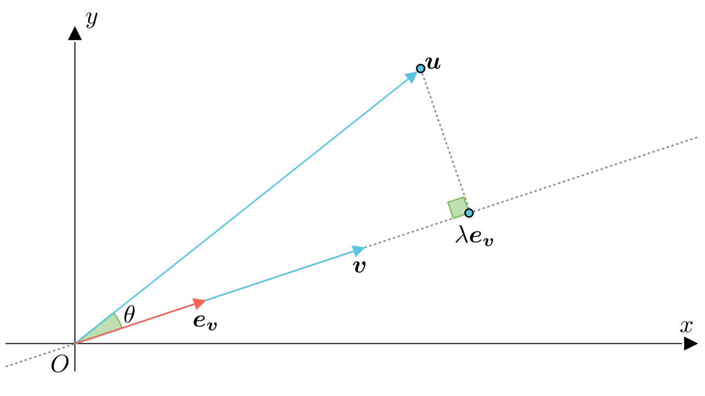

3. 点积的性质
交换律，数乘结合律，**分配律**
 

4. 正交

## 11.4 叉积(向量积)

1. 行列式
>$$\boldsymbol{S}=\boldsymbol{u}\times\boldsymbol{v}=\begin{vmatrix}\boldsymbol{i}&\boldsymbol{j}&\boldsymbol{k}\\u_1&u_2&u_3\\v_1&v_2&v_3\end{vmatrix}=\begin{vmatrix}u_2&u_3\\v_2&v_3\end{vmatrix}\boldsymbol{i}-\begin{vmatrix}u_1&u_3\\v_1&v_3\end{vmatrix}\boldsymbol{j}+\begin{vmatrix}u_1&u_2\\v_1&v_2\end{vmatrix}\boldsymbol{k}$$
2. 几何意义

有向面积
   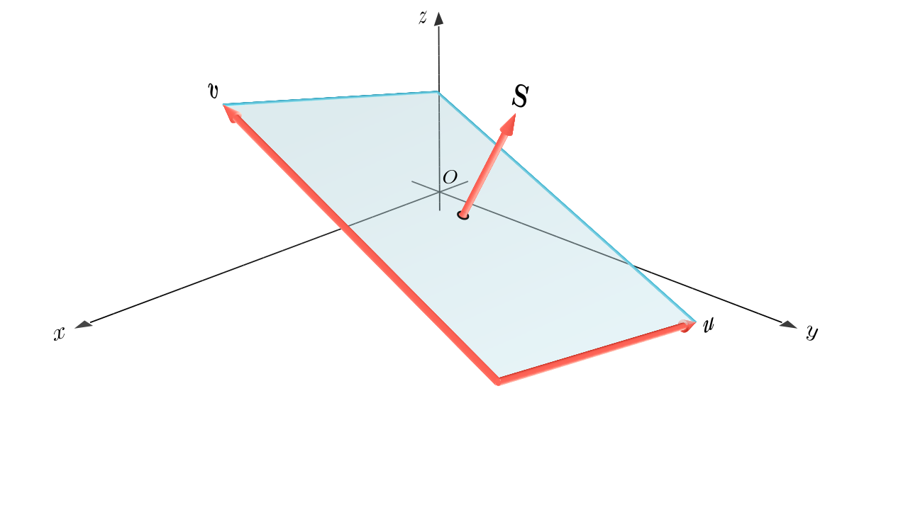

3. 性质

>$$
\begin{array}{c|c}
    \hline
    \\
    \quad\begin{aligned} \text{反交换律}\ \ \\ \text{分配律}\quad\\\text{数乘结合律} \end{aligned}\quad & \quad\begin{aligned}\boldsymbol{u}\times\boldsymbol{v}=-\boldsymbol{v}\times\boldsymbol{u}\qquad\quad\\ \boldsymbol{u}\times(\boldsymbol{v}+\boldsymbol{w})=\boldsymbol{u}\times\boldsymbol{v}+\boldsymbol{u}\times\boldsymbol{w}\\\lambda (\boldsymbol{u}\times\boldsymbol{v})=(\lambda \boldsymbol{u})\times\boldsymbol{v}=\boldsymbol{u}\times(\lambda\boldsymbol{v}) \end{aligned}\quad\\
    \\
    \hline
\end{array}
$$

**混合积**
$(u\times v)\cdot w$

$(u\times v)\cdot w= u \cdot (v \times w)$
 

$u\times (v\times w)=(u\cdot w) v - (u\cdot v) w$
 

## 11.5 向量值函数

1. 用方程表示平面
截距式、点法式、一般式

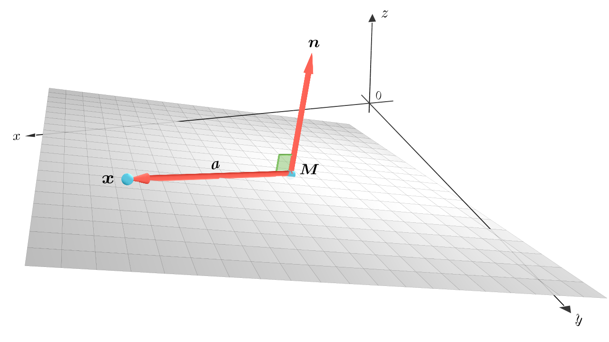

2. 平面的夹角
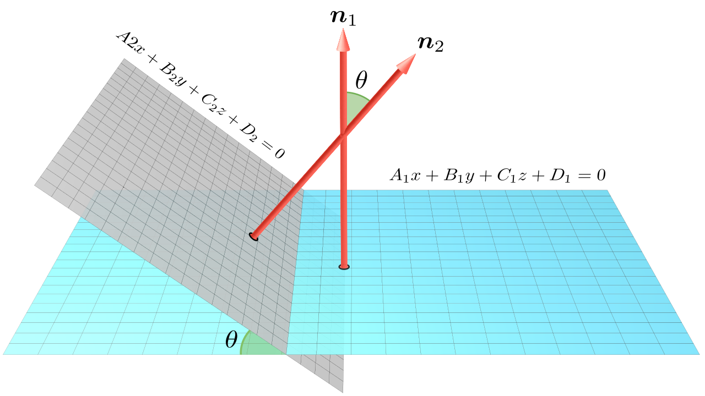

3. 点到平面的距离
复习：点到直线的距离

 

4. 直线方程
   参数方程$\rArr$向量方程（向量形式）
   对称方程
 

5. 直线间的夹角
6. 直线与平面的夹角
 

7. **曲线**
点系$\rArr$曲线
参数方程$\rArr$向量方程
>$F(t)=f(t)\boldsymbol{i}+g(t)\boldsymbol{j}+h(t)\boldsymbol{k}=<f(t)\boldsymbol{i},g(t)\boldsymbol{j},h(t)\boldsymbol{k}>$

* 曲线的微分：
  * 求导：几何意义(一次、二次)
  * $F'(t)=f'(t)\boldsymbol{i}+g'(t)\boldsymbol{j}+h'(t)\boldsymbol{k}=<f'(t)\boldsymbol{i},g'(t)\boldsymbol{j},h'(t)\boldsymbol{k}>$
  * 性质：
    * $D_t[F(t)\times G(t)]= F(t)\times G'(t)+ F'(t)\times G(t)$

 

* 求曲线的长度
> 对于曲线:$l: F(t)=f(t)\boldsymbol{i}+g(t)\boldsymbol{j}+h(t)\boldsymbol{k} $
> 
> $L = \displaystyle\int_a^b\sqrt{(\frac{dx}{dt})^2+(\frac{dy}{dt})^2+(\frac{dz}{dt})^2}dt$
> 
> $\displaystyle=\int_a^b\sqrt{1+(\frac{dy}{dx})^2+(\frac{dz}{dx})^2} dx$

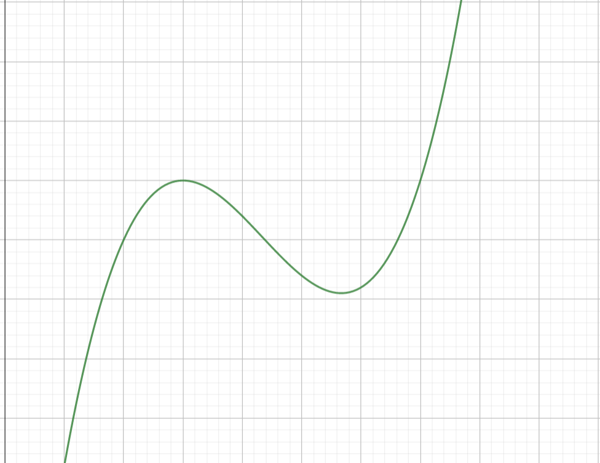

1. **曲面**
柱面 cylindrical surface
二次曲面 quadric surface
*例：如何画空间曲面草图? (固定一个变量)*

$4x^2+4y^2-z^2=4$ 方程

$z=f(x,y)=x^2+y^2$ 函数

$z=f(x,y)=x^2+\displaystyle\frac{y^2}{2}$ 函数
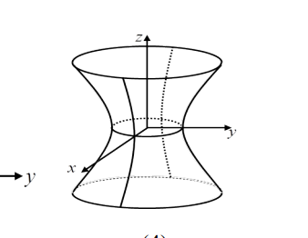

## 11.9 柱面坐标系和球面坐标系
$(x,y,z)\rArr (\rho,\theta,z)$ or $(\rho,\theta,\phi)$

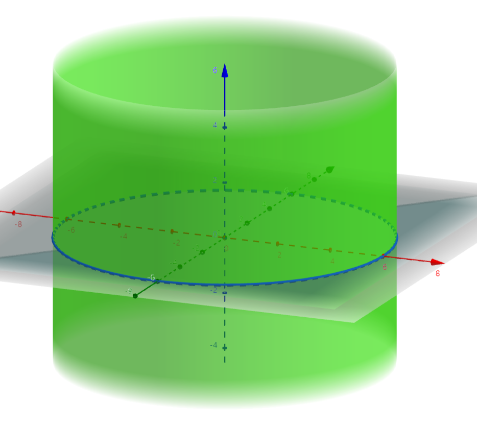

## 例题
1. 求两个平面的交线
2. 求异面直线距离
  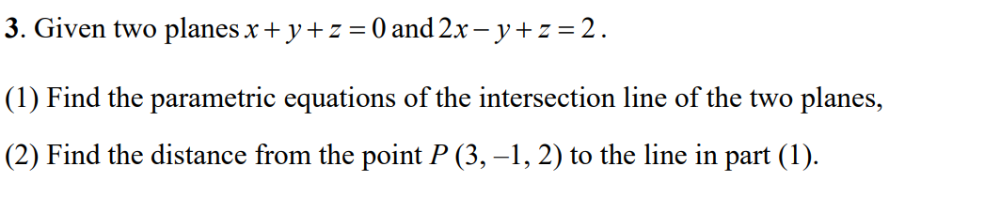
4. 求异面直线最近的两点距离
5. 给三个点，求出平面方程
  （↓这题不讲了）
   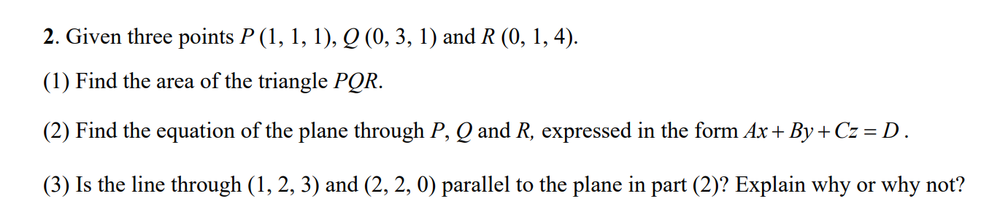
6. 找一个向量在另一个向量上的投影
   > The vector projection of $\boldsymbol{u=i+ j -k}$ on $\boldsymbol{v=j+ 2k }$ is 
   $-\frac{1}{5}j-\frac{2}{5}k$
 
   
7. >Given the curve  $C:r(t)=(e^tcos\pi t)\boldsymbol{i}+(e^tsin\pi t)\boldsymbol{j}+e^t\boldsymbol{k}$
Show that the curve $C$ lies on a quadric surface and find the equation of the surface. 

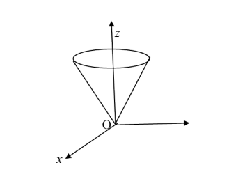

1. 求曲面被切的边缘
   >Let C be the curve of intersection of the paraboloid $z=4-2x^2-y^2$
   and plane $2x-y=2$
   解方程游戏
   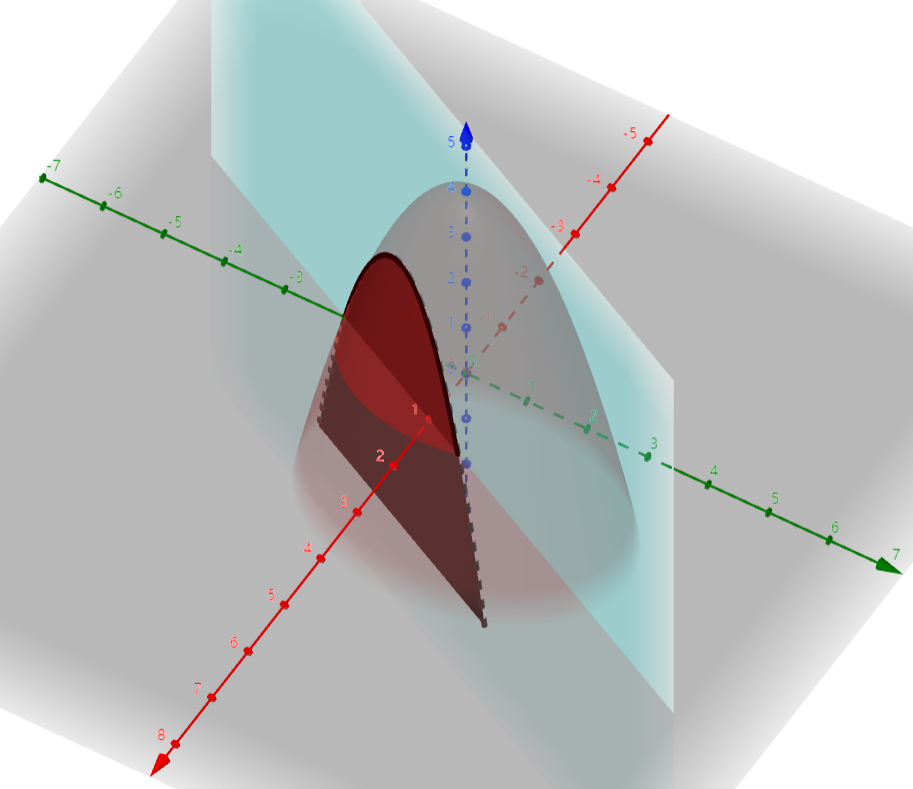

# Chapter 12二元变量函数

**主线：找切平面**

## 12.1 二元变量函数
单变量函数$\rArr$双变量函数

## 12.2 微分(偏导数)

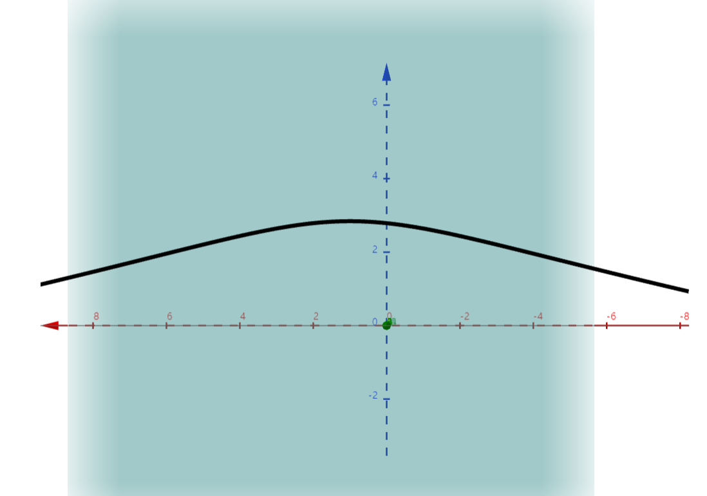
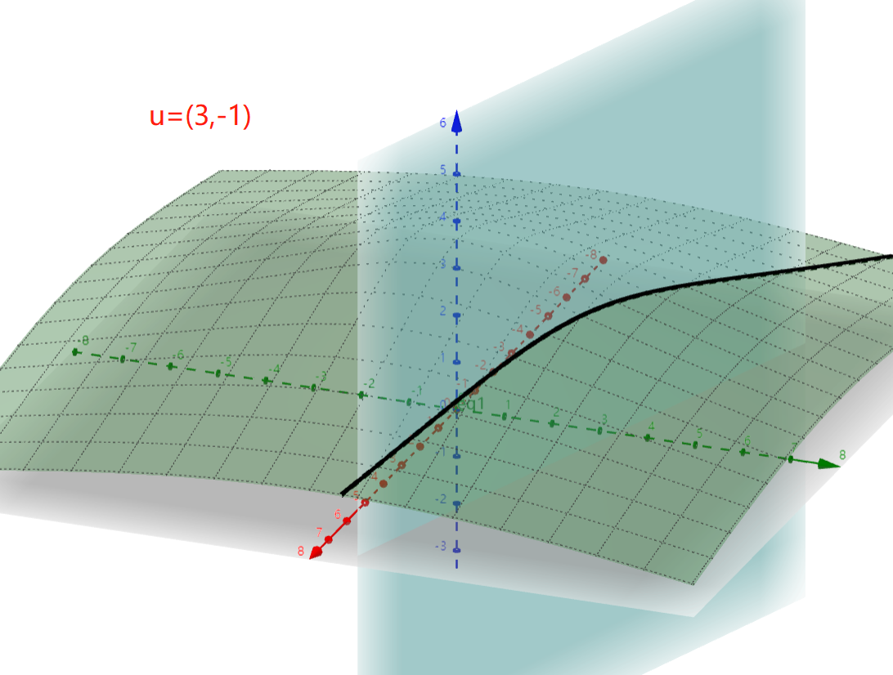

**高阶的偏导数
混合的偏导数**
 

**求二元函数的切平面**
法一：
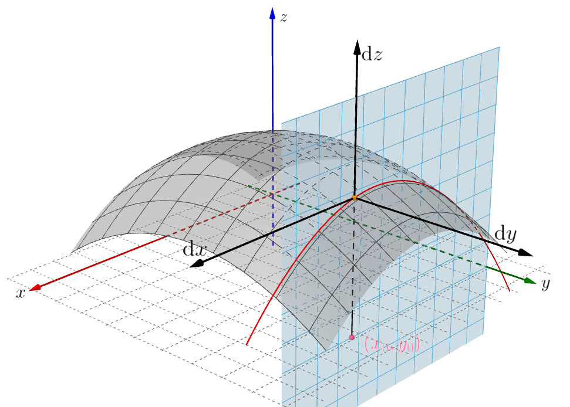
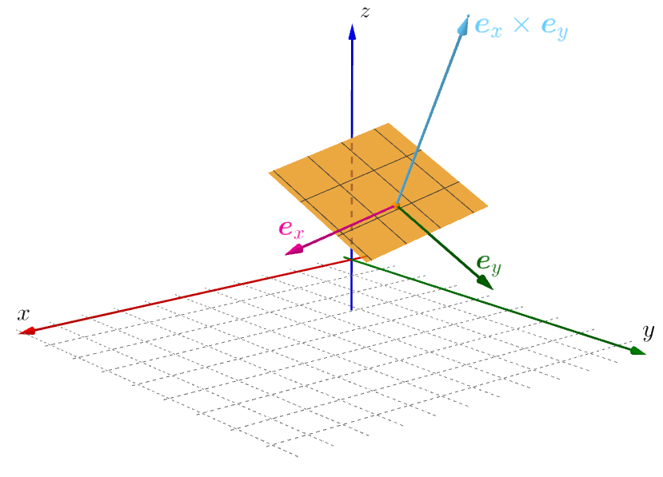

>$\boldsymbol{n}=\boldsymbol{e}_{x}\times\boldsymbol{e}_{y}=\begin{vmatrix}\boldsymbol{e_1}&\boldsymbol{e_2}&\boldsymbol{e_3}\\1&0&f_x(x_0,y_0)\\0&1&f_y(x_0,y_0)\end{vmatrix}=-f_x(x_0,y_0)\boldsymbol{e_1}-f_y(x_0,y_0)\boldsymbol{e_2}+\boldsymbol{e_3}$

 

法二：高维函数的等势面(线)
二元函数：等值线
三元函数：等值面
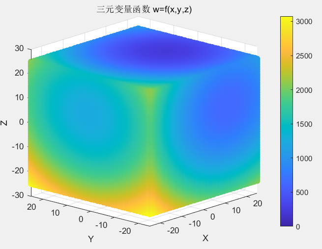

##12.3 二元函数的极限
1. 求极限

*例：判断极限存在？求极限。*
$\displaystyle\lim_{(x,y)\to(0,0)}\frac{x^2+y^2}{x^2-y^2}$ ?

$\displaystyle\lim_{(x,y)\to(0,0)}\frac{xy}{x^2+y^2}$ ?
计算方法：换元
 

2. 判断连续：
   1. 整式多项式是连续的
   2. 复合规则：连续的复合连续的依然是连续的

## 12.4 二元函数的微分
1. 全微分(切平面、线性近似)
$f(a+\Delta a,b+\Delta b)=f(a,b) + \Delta af_x(a,b)+\Delta bf_y(a,b)+\epsilon$

$f(x,y)=f(x_0,y_0) + (x-x_0)f_x(x_0,y_0)+(y-y_0)f_y(x_0,y_0)+\epsilon$ $\rArr$ 平面方程
 

## 12.5 梯度和方向导数

1. 方向导数
    $u$:单位向量
   几何意义
   
2. 梯度
   1. 定义：一个向量，其方向上的坡度是最大的
   2. 几何意义
      指向山峰吗？
    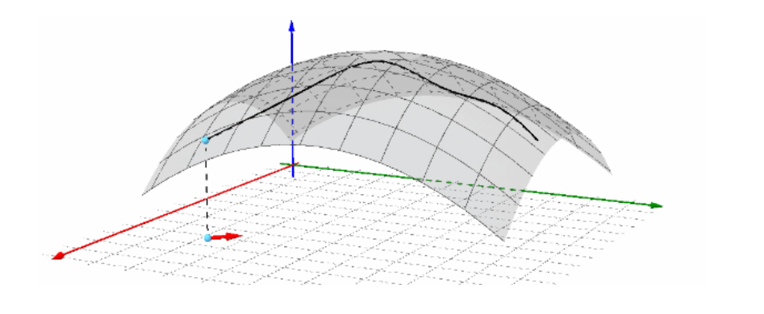

3. 方向导数和梯度的关系：
   梯度方向的方向导数最大，$D_uf(p)=u\cdot \nabla f(p)$

*Textbook p649*

## 12.6 链式法则（解题法）
*例：$w=x^2y+y+xz$, where $x=cos\theta, y= sin\theta,z=\theta^2$*
*Find $\frac{dw}{d\theta}$*

经验技术：隐函数求导
Implicit: $F(x,y,z)=0$
$\displaystyle \frac{\partial{z}}{\partial{x}}=-\frac{F_x}{F_z}$

## 12.7 切平面
## 12.8 找面上的最大值最小值
1. Critical points有以下几种:
   1. Boundary
   2. Stationary point: 两个偏导数(或任意两个方向导数)都是0
   3. Singular point：尖尖

 

1. 对于stationary points。海森矩阵:二次检验 **stationary point**
   1. 雅可比矩阵
   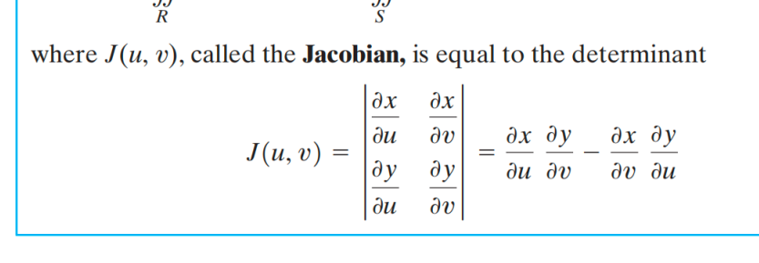
   2. 海森矩阵
   $H=\frac{\partial^2 z}{\partial(x,y)^2}=\begin{pmatrix}f_{xx}&f_{xy}\\f_{yx}&f_{yy}\end{pmatrix}$

    看两个：
      二、$f_{xx} 或 f_{yy}的正负$
         $f_{xx} < 0$ ，该点是极小值
         $f_{xx} > 0$ ，该点是极大值
      一、$det(H)的正负$
         $det(H)>0$，该点是极值
         $det(H)<0$，该点不是极值(图三)
   
   
   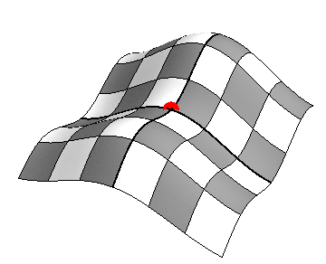

   *例：函数$f(x,y)=4(x-y)-x^2-y^2$的极值情况?*
   *Ans:有一个极大值，值为8*
 

2. 拉格朗日乘子法；检验 **Boundary**
   即，在约束条件下求极值  
   

    例：求 $z=f(x,y)= x^2+y^2$ 
        在 $g(x,y)=x^2y=3$ 约束下的最小值
    
    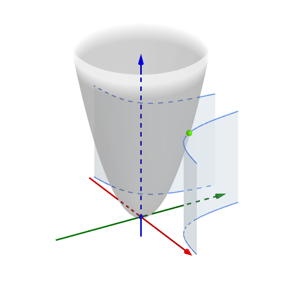

    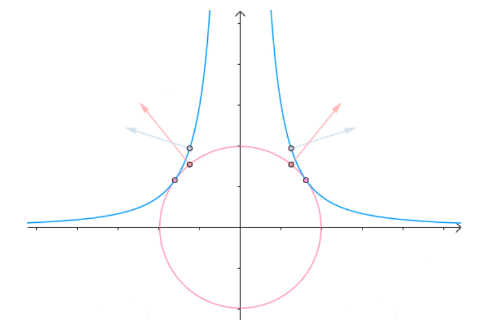
    在切点处，梯度的方向一致
    （复习：梯度是一个方向，可以看作是地上的一个向量）

  $$
\begin{cases}
f(x,y)=x^2+y^2\\
\\
g(x,y)=x^2y\\
\\
\nabla f=\lambda\nabla g\\
\\
x^2y=3
\end{cases}
\implies 
\begin{cases}
    \begin{pmatrix}2x\\2y\end{pmatrix}=\lambda\begin{pmatrix}2xy\\x^2\end{pmatrix}\\
    \\
    x^2y=3
\end{cases}
$$

*例：内接于半径为a的球的长方体，体积最大为？*

## 例题

1. 求偏导
   1. >$z=\displaystyle\frac{x-y}{x+y}$, $\quad$find $\displaystyle\frac{\partial z}{\partial{x}},\displaystyle\frac{\partial z}{\partial{y}},\displaystyle\frac{\partial^2 z}{\partial{y}\partial{x}}$
   2. >$z=\displaystyle\frac{y}{x}arcsin\frac{x}{y}$, $\quad$find $x\displaystyle\frac{\partial{z}}{\partial{x}}+y\frac{\partial{z}}{\partial{y}}$.  Ans=0
   
   复习一下三角函数求导
   $sin(x)',cos(x)',tan(x)',csc(x)',sec(x)',cot(x)'$
   $arcsin(x)',arccos(x)',arctan(x)',arccsc(x)',arcsec(x)',arccot(x)'$

    

   $cos(x),-sin(x),sec^2(x),-cot(x)csc(x),tan(x)sec(x),-csc^2(x)$
   $\displaystyle \frac{1}{\sqrt{1-x^2}},\frac{-1}{\sqrt{1-x^2}},\frac{1}{1+x^2},\frac{1}{|x|\sqrt{1-x^2}},\frac{-1}{|x|\sqrt{1-x^2}},\frac{-1}{1+x^2}$
    

   3. >Implicit: $z(x,y)$is defined as $\displaystyle xyz=ln\frac{z}{y}$. Find $\displaystyle \frac{\partial z}{\partial x}, \frac{\partial z}{\partial y}$

2. 求极限
   1. > 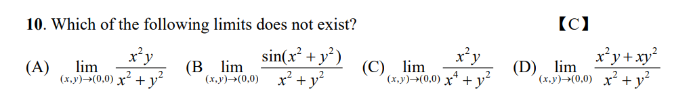

3. 求方向导数和梯度
   1. >Given two points $A( 3, 0)$  and $B( 1, 3)$ . Find the directional derivative of the function $f(x,y)=xe^{xy}$ at the point $A$ in the direction of the vector$\vec{AB}$
   2. >Let $\boldsymbol{u}=3\boldsymbol{i}-4\boldsymbol{j}$, $\boldsymbol{v}=4\boldsymbol{i}+3\boldsymbol{j}$. Suppose that at point $P(x_0,y_0)$,$D_uf(x_0,y_0)=-6$, $D_vf(x_0,y_0)=17$. Find $\nabla f(x_0,y_0)$. $\quad$(Ans:$\langle 10,15\rangle$)
   3. >The unit vector in the direction in which $f(x,y,z)=x^2+2y^2-3z^2$ increases most rapidly at $P(1,1,1)$

4. 全微分
   1. > Find the tangent planes of the surface $x^2+2y^2+3z^2=21$ that are parallel to the plane $x+4y+6z=0$

   ps：只能求出比例，需再解
   
   2. > Find all points $(x, y) $at which the tangent plane to the graph $z=x^2+10x-2y^2+4y+2xy\quad$  Ans:(-4,-1)

5. 求极值和最值
   1. > Find the local maximum value and local minimum value of $f(x,y)=xy+\displaystyle \frac{2}{x}+\frac{4}{y}$
   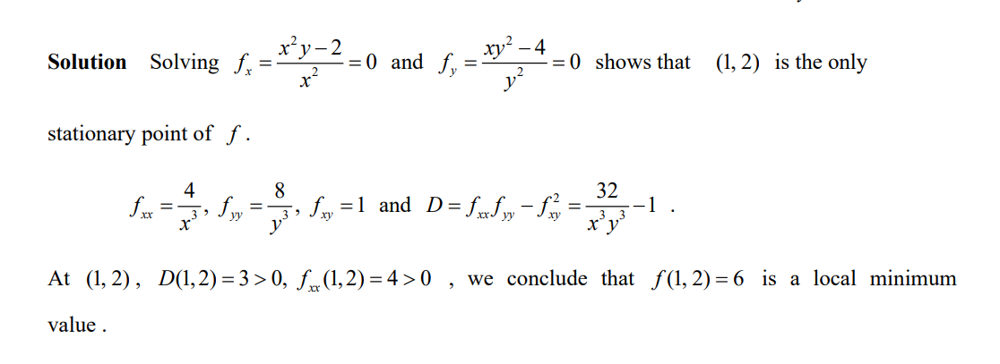

   2. >Find the global maximum value and global mimimum value of $f(x,y)=x^2-y^2+2$ on the closed and bounded set $S=\{(x,y):x^2+\frac{1}{4}y^2\leq 1\}$

# Not this time
$\sum\frac{1}{n^2-1}$
$\sum[(c-\frac{c}{n+1})^2-(c-\frac{c}{n})^2]$

